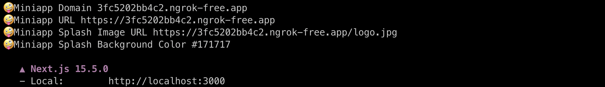
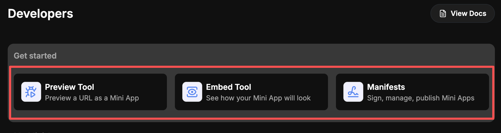

<div align="right">

[**English**](./README.md) | **简体中文**

</div>

---

# 🚀  MiniApp-Starter: Farcaster Mini App 脚手架

欢迎使用 MiniApp-Starter！这是一个基于 **Next.js** 的简单脚手架，帮助你快速配置 Farcaster Mini App 的 **Manifest** 和 **Embed**。它通过自动化生成 Manifest 文件（支持 ngrok 本地测试），并结合 Next.js 标准 metadata 机制，提供简化 Embed tag 包装函数，让你轻松实现社交卡片预览和交互。

## 📚 基础概念

Mini App 的集成依赖两个关键部分：**Manifest** 和 **Embed**。它们各自负责不同的层面，确保 App 在 Farcaster 生态中被正确识别和交互。下面详细说明作用、配置方式和最佳实践：

### 📄 Manifest (`public/.well-known/farcaster.json`)

Manifest 是 Mini App 的**身份证 🪪**，用于在 Farcaster 客户端声明你的 App 元数据。它让 Farcaster 自动验证域名、显示 App 图标/名称，并启用高级功能等（如 Quick Auth 和 Actions）。

**关键目的：让 Farcaster 知道配置中的域名是一个 Mini App。**

### 🎨 Embed (页面 Meta 标签)

Embed 是网页的**预览卡片**，通过 HTML meta 标签（如 fc:miniapp）定义你的页面在 Farcaster 帖子中的“社交卡片”预览和交互行为。它不仅仅是静态链接，而是将你的 dApp 转化为一个动态、视觉化的社交钩子：生成吸引人的预览图像、标题、描述和按钮，让用户在 Feed 中一眼就想点击。

**核心效果：让 dApp 社交卡片更丰富化、可操作化和更具吸引力，点击卡片后可即时行动，无缝进入 Mini App 模态执行某个操作。**

配置相关参考[官网定义](https://miniapps.farcaster.xyz/docs/specification)。

## ⚙️ Manifest 配置自动化

如上介绍，Farcaster 将 Mini App 的应用身份信息都配置在 `public/.well-known/farcaster.json` 中，但 Farcaster 的调试功能需要基于一个"非本地 URL"，即 `≠ localhost:3000`，在本地测试时，我们可以用 `ngrok` 服务代理 `localhost:3000`。因为这个 URL 同时也要固定的声明在 `farcaster.json` 文件中，所以我们采用**构建自动化**生成 `farcaster.json` 文件的方式，避免了每次测试需要手动替换配置文件的麻烦。

### 🎯 如何启动

1.**🔌 启动 ngrok 对 3000 端口进行代理**

```bash
ngrok http 3000
```

2.**📝 将代理后的域名配置到 `.env.local` 文件中**

```bash
# ... ngrok logs
Forwarding                    https://3fc5202bb4c2.ngrok-free.app -> http://localhost:3000

# 将代理后的地址，只截取域名部分配置到 .env.local 文件中
# .env.local
NEXT_PUBLIC_APP_DOMAIN=3fc5202bb4c2.ngrok-free.app
```

3.**▶️ 启动项目**

```bash
pnpm run dev
```

4.**📊 查看 terminal log 信息**

自动化脚本基本将调试需要用到的所有信息都打印出来（有新增的可以按需修改脚本 `/scripts/generate-farcaster-json.cjs`），方便在 Farcaster 上测试时直接复制使用，如下图：



## 🏗️ 页面 Embed meta 标签设置

基于 `Next.js` 架构，metadata 信息设置在页面对应的 `layout.ts`（服务端组件）中，而 Farcaster Embed 标签可以简单的理解为在 Base HTML Metadata 的基础下，增加了一些 Farcaster 所能识别的 meta 标签。

它的本质是，定义了一个 meta 标签 `name` 为 `fc:miniapp`，`content` 为一个 `json` 字符串，这个 `json` 字符串是它官方文档中开放设置的配置字段序列化后的结果，这样它反序列化便可拿到对应信息。

HTML 伪代码如下：

```html
<html>
 <head>
 <!-- Farcaster Embed 配置（核心 meta 标签） -->
  <meta property="fc:miniapp" content='{
    "version": "1",
    "imageUrl":{
      "title": "立即参与",
      "action": {
        "type": "launch_miniapp",
        "url": "https://your-domain.com/xxx"
      },
    }
  }' />
 </head>
</html>
```

**提示**：为了方便结合 Next.js 开发，封装了一个包装函数 `@/lib/generateFrameMetadata.ts`，配置页面时可直接调用。

通用示例，所有页面设置均可参考：

```ts
// app/xxx/layout.ts

// ... other imports
import { APP_BASE_URL } from '@/lib/constants';
import { generateFrameMetadata } from '@/lib/generateFrameMetadata';
import type { Metadata } from 'next';

export async function generateMetadata(): Promise<Metadata> {
 // Base metadata
 const metadata: Metadata = {
  title: 'Your Page Name',
  description: 'Your Page Description',
 };

 // 下面是该页面用于 Farcaster 社交卡片的相关配置
 // 如果不需要在 Farcaster 中使用的页面，可以跳过直接返回上面的 metadata
 // Shareable page url
 const frameUrl = `${APP_BASE_URL}/xxx`;

 // 完整字段含义参考官方定义：https://miniapps.farcaster.xyz/docs/specification
 const frameMetadata = await generateFrameMetadata({
  name: metadata.title as string,
  title: metadata.title as string,
  url: frameUrl,
  description: metadata.description as string,
  imageUrl: `${frameUrl}/opengraph-image`, // 动态生成 opengraph-image，文档参考 https://nextjs.org/docs/app/api-reference/file-conventions/metadata/opengraph-image#generate-images-using-code-js-ts-tsx
  launchButtonName: 'Click to XXX',
 });

 return {
  ...metadata,
  ...frameMetadata,
 };
}

export default function Layout({
 children,
}: Readonly<{
 children: React.ReactNode;
}>) {
 return (
  <html>
   <body>{children}</body>
  </html>
 );
}
```

（目前 `generateFrameMetadata` 只写了 `launch_miniapp` 一种 button action，更多高级 action 可按需拓展。）

## 🧪 如何测试

在设置完 Manifest 或页面 Embed 标签后，可以通过 Farcaster 官方调试工具 <https://farcaster.xyz/~/developers/mini-apps/debug> 测试你的 link 是否读取到正确的配置。

测试工具页如下图，可以分别进入查看配置是否正确:



Farcaster 手机 APP 上也有对应的 Developer 调试入口，可以在手机端测试体验。具体页面的社交卡片，可以发测试贴带上页面链接查看**最准确**的效果。

（测试需要输入的信息如上面介绍，可快速从日志中复制）。

## 🔗 参考

1. Farcaster：<https://miniapps.farcaster.xyz/>
2. Ngrok：<https://ngrok.com/>
